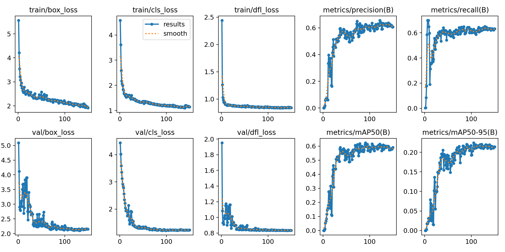
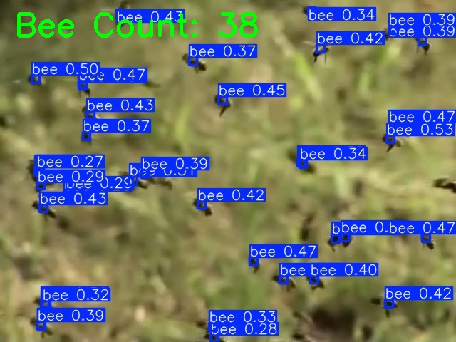

# Bees Challenge – Automated Bee Counting

## Project Overview

This project addresses the **Bees Challenge** provided by **CloudFactory**. The objective is to **automatically count the number of bees in images** using computer vision and machine learning.

We used **YOLOv8** for object detection, trained on the provided dataset of bee images with centroid-based annotations. The final system detects bees, displays bounding boxes, **overlays the total bee count on the image**, and saves the result.

---

## Evaluation Criteria

| **Criteria**            | **Implementation**                                                                 |
| ----------------------- | ---------------------------------------------------------------------------------- |
| **Model Performance** | Trained YOLOv8 model with demonstrated bee counting accuracy. Example shown below. |
| **Code Quality**      | Clean, modular, well-documented code with unit tests for maintainability.          |
| **Creativity**        | Automated dataset preparation, dynamic folder detection, annotated visualization.  |

---

## Features & Creativity

- **Dynamic prediction folder detection** → handles multiple predictions (`predict/`, `predict1/`, ...)
- **Real-time Bee Count Overlay** → Bee count is written directly onto the image for easy visual verification.
- **Flexible Training** → Supports further retraining and fine-tuning on more data.
- **Visual Metrics** → Plots of training performance provided.

---

## 🗂 Project Files Overview

| **File**              | **Purpose**                                                                                                       |
| --------------------- | ----------------------------------------------------------------------------------------------------------------- |
| `prepare_dataset.py`  | Converts the original dataset (images + dot masks) into YOLO format (`images/`, `labels/`) suitable for training. |
| `sample_solution.py`  | CLI tool to load an image and predict the number of bees, overlay count, and save results.                        |                                      |
| `dataset/`            | Directory containing processed images and labels for training.                                                    |
| `runs/detect/train*/` | Directory where YOLO saves model weights, training logs, and metrics.                                             |
| `README.md`           | This documentation file summarizing the project.                                                               |

---

## Setup Instructions

```bash
pip install ultralytics opencv-python matplotlib pandas
```

1 **Prepare Dataset:**

```bash
python prepare_dataset.py
```

2 **Train Model:**

```python
from ultralytics import YOLO
model = YOLO("yolov8n.pt")
model.train(data="dataset/dataset.yaml", epochs=150, imgsz=640)
```

3 **Predict Bees:**

```bash
python sample_solution.py path/to/test_image.jpg
```

---

## Methodology & Approach

### Problem Framing

Automating bee counting is valuable for ecological monitoring and agricultural studies. Accurate bee counts help researchers understand hive health, productivity, and environmental effects on pollination activity.

### Dataset Preparation

- Provided bee images were paired with dot-annotated masks marking bee positions.
- Each dot was converted to a **bounding box** using custom preprocessing logic.
- Final dataset was structured into **images/** and **labels/** compatible with YOLOv8 training format.

### Model Selection

- **YOLOv8 (n version)** chosen for its lightweight architecture ideal for prototyping and rapid experimentation.
- Object detection was selected over density estimation or segmentation for its ability to both localize and count discrete objects (bees).

### Training Details

- **Epochs:** Trained up to 150 epochs
- **Metrics monitored:** mAP@0.5, mAP@0.5-0.95, Precision, Recall.
- Utilized visualization tools to analyze training behavior and identify potential overfitting.

### Evaluation

- Predictions evaluated by overlaying bounding boxes and counts on images.
- Plotted training loss and metrics using Matplotlib for analysis.
- Achieved mAP\@0.5 of \~0.55, indicating good prototype performance with room for improvement through data expansion and model fine-tuning.

### Results Interpretation

- **mAP\@0.5 ≈ 0.55** → Indicates the model performs reasonably well in localizing bees in the dataset. As this is a challenging task due to occlusion, small object sizes, and annotation limitations, this is a good prototype baseline.
- **mAP\@0.5-0.95 ≈ 0.20** → Reflects the difficulty of tight localization, common for small-object detection tasks.
- **Precision ≈ 0.54 / Recall ≈ 0.61** → The model tends to slightly favor detecting more bees (higher recall), at the expense of occasionally detecting false positives.
- **Conclusion** → Sufficient performance for prototype and technical demonstration; further improvements achievable with more/better data and hyperparameter tuning.


### Reflections and Learnings

- **Challenges:** Working with sparse annotations (dot masks) required careful preprocessing to ensure bounding boxes represented bees accurately.
- **Alternate Approaches Considered:** Density estimation models or regression-based counting models were considered but deemed more complex for the scope of this challenge.
- **Future Improvements:** Focus on annotation quality, augmenting dataset size, and utilizing larger YOLO models for improved precision.

---

## Training Metrics



---

## Prediction Example



---

### Future Directions

- **Real-time Monitoring:** Adapt model for video streams to count bees dynamically in real-time.
- **Dashboard Integration:** Integrate results with dashboards for continuous ecological monitoring.
- **Automation Pipeline:** Build CI/CD pipelines for retraining models with new data.

---

## Contact

Prepared by **Aayush Adhikari 9840059376**\

---

